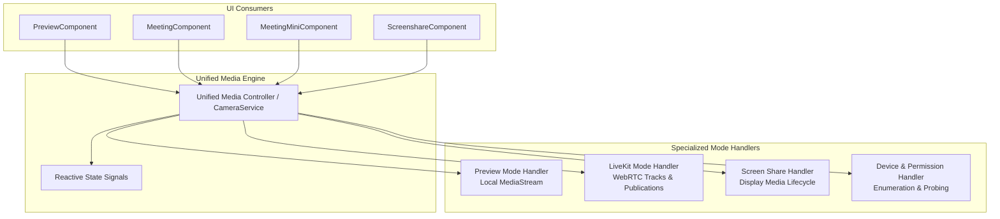

# Unified Media Device Management: Master Architecture & Roadmap

---

## 1. Overview & Problem Statement

Currently, media device acquisition, lifecycle control, track publishing, and hardware teardown are split across multiple disparate services and components:
- `MediaPermissionsService` (Permissions API queries & fallback `getUserMedia` probes)
- `DeviceService` (Device enumeration & initial permission probing)
- `CameraService` (LiveKit track creation, muting, publishing, and display media)
- `MeetingService` (Preview stream acquisition, in-meeting camera/mic toggling, media release)
- `MeetingComponent` (Direct `navigator.mediaDevices.getUserMedia` for mic activation, direct `createLocalScreenTracks` for screen sharing)
- `PreviewComponent` (Preview stream attachments, direct permission requests)
- `ScreenRecorderService` (Independent screen and camera capture for recording)

### Objective
Unify all camera, microphone, and screen sharing operations into a **single, robust, mode-aware Media Controller Service** without breaking existing functionalities:
1. **Single Point of Control**: Every start, stop, toggle, switch, and release operation for camera, mic, and screen share passes through a single unified interface.
2. **Zero Regressions & Compatibility**: Seamless interoperability across Preview Mode (raw `MediaStream`), Active Call Mode (LiveKit WebRTC `Room`), and Mini Mode.
3. **Deterministic Hardware Release**: Guarantee zero camera indicator light sticking and zero lingering microphone tracks when navigating or switching modes.
4. **Unified State Management**: Clean Angular Signals for media state (`isCameraOn`, `isMicOn`, `isScreenSharing`, `selectedCameraId`, `selectedMicId`, `selectedSpeakerId`, `mediaError`).

---

## 2. Target Architecture Diagram

---

## 3. Plan Index & Roadmap

| Plan File | Phase / Area | Scope & Key Focus |
| :--- | :--- | :--- |
| **[01_phase1_core_media_service_and_signals.md](./01_phase1_core_media_service_and_signals.md)** | Phase 1 | Core Unified Media Service & State Foundation: Signals, Interfaces, Mode Engine, Error Handling. |
| **[02_phase2_preview_mode_and_permission_cleanup.md](./02_phase2_preview_mode_and_permission_cleanup.md)** | Phase 2 | Preview Flow Integration & Device Probing Cleanup: Managing Preview streams, eliminating LED light leaks, integrating with `PreviewComponent` and `DeviceService`. |
| **[03_phase3_meeting_webrtc_camera_mic_controls.md](./03_phase3_meeting_webrtc_camera_mic_controls.md)** | Phase 3 | Active Meeting Room (LiveKit WebRTC) Camera & Mic Unification: Track creation, mute/unmute, background effects, device switching, WebRTC renegotiation safety. |
| **[04_phase4_screen_sharing_unification.md](./04_phase4_screen_sharing_unification.md)** | Phase 4 | Screen Sharing Unification: Standardizing 1080p capture, audio isolation to prevent mic conflict, native "Stop Sharing" detection, preview in `ScreenshareComponent` and `MeetingMiniComponent`. |
| **[05_phase5_teardown_lifecycle_and_edge_cases.md](./05_phase5_teardown_lifecycle_and_edge_cases.md)** | Phase 5 | Teardown, Background Tabs, Hardware Hot-Plugging & Edge Cases: Deterministic hardware release, visibility change handling, memory leak elimination. |
| **[06_verification_and_test_suites.md](./06_verification_and_test_suites.md)** | Verification | Comprehensive Section-by-Section Testing Suites & Quality Assurance Matrix. |

---

## 4. Migration & Safety Guidelines

1. **Non-Breaking Delegation**: Existing public helper methods on `MeetingService` (such as `toggleCamera()`, `toggleMic()`, `requestMediaPreview()`, and `releaseAllMedia()`) will remain intact, internally delegating to the unified engine.
2. **Incremental Rollout**: Components can be migrated phase by phase without requiring massive simultaneous refactoring.
3. **Strict Fallbacks**: If hardware constraints (e.g. 720p or specific device IDs) fail, the engine automatically falls back to system defaults rather than crashing or hanging.
