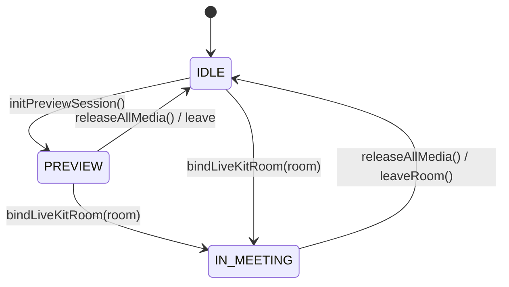

# Plan 01: Core Media Service & State Foundation (Phase 1)

---

## 1. Goal & Scope

Establish a unified, reactive media controller (`CameraService` or `UnifiedMediaService`) that serves as the single source of truth for all camera, microphone, and screen share states, operations, and device bindings across the application.

---

## 2. Technical Design & Interfaces

### 2.1 Media Mode State Machine
The unified engine operates in one of three explicit operational modes:
- **`IDLE`**: No active hardware streams or WebRTC tracks.
- **`PREVIEW`**: Local `MediaStream` active for testing/preview in `PreviewComponent` before joining a room.
- **`IN_MEETING`**: LiveKit WebRTC `Room` active with `LocalParticipant` tracks (`LocalVideoTrack`, `LocalAudioTrack`, `LocalScreenTrack`).



### 2.2 Core Signals Definition
```typescript
export interface MediaState {
  isCameraOn: Signal<boolean>;
  isMicOn: Signal<boolean>;
  isScreenSharing: Signal<boolean>;
  isMediaLoading: Signal<boolean>;
  mediaMode: Signal<'idle' | 'preview' | 'in-meeting'>;
  previewStream: Signal<MediaStream | undefined>;
  localCameraTrack: Signal<LocalVideoTrack | undefined>;
  localScreenTrack: Signal<LocalVideoTrack | undefined>;
  selectedCameraId: Signal<string | null>;
  selectedMicId: Signal<string | null>;
  selectedSpeakerId: Signal<string | null>;
  mediaError: Signal<string | null>;
}
```

### 2.3 Unified API Methods Specification
```typescript
// Camera Management
async startCamera(deviceId?: string): Promise<boolean>;
async stopCamera(): Promise<void>;
async toggleCamera(deviceId?: string): Promise<boolean>;
async switchCamera(deviceId: string): Promise<boolean>;

// Microphone Management
async startMic(deviceId?: string): Promise<boolean>;
async stopMic(): Promise<void>;
async toggleMic(deviceId?: string): Promise<boolean>;
async switchMic(deviceId: string): Promise<boolean>;

// Screen Share Management
async startScreenShare(): Promise<LocalVideoTrack | undefined>;
async stopScreenShare(): Promise<void>;
async toggleScreenShare(): Promise<boolean>;

// Lifecycle & Room Bindings
async initPreviewSession(enableVideo: boolean, cameraDeviceId?: string, micDeviceId?: string): Promise<MediaStream | undefined>;
void bindLiveKitRoom(room: Room): void;
void unbindLiveKitRoom(): void;
async releaseAllMedia(): Promise<void>;
```

---

## 3. Files to Modify

| File | Changes Required |
| :--- | :--- |
| **`src/app/providers/services/camera.service.ts`** | Expand class into full unified controller: declare signals, mode state machine, standardized `createCameraTrack` with fallback constraints, error handler, and public API methods. |

---

## 4. Expected Effects & Impact
- **Single Source of Truth**: UI components observe signals directly (`isCameraOn()`, `isMicOn()`, `isScreenSharing()`) rather than managing disparate boolean flags.
- **Robust Error Handling**: Handles `NotAllowedError` (user denied), `NotFoundError` (no hardware attached), and `OverconstrainedError` (unsupported resolution) uniformly with graceful fallbacks.
- **Zero Consumer Breakage**: At this phase, existing methods in `CameraService` are preserved or aliased.

---

## 5. Pros & Cons

### Pros
- Eliminates state divergence between preview, header, sidebar, and floating mini-meeting.
- Standardizes video resolution (`VideoPresets.h720`) across all creation pathways.
- Provides synchronous signal reads (`isCameraOn()`) alongside async Promise executions.

### Cons & Mitigation
- *Risk*: Multiple components calling `toggleCamera()` concurrently during transitions.
- *Mitigation*: Implement an internal `isMediaLoading` lock to reject or debounce concurrent toggle requests.
