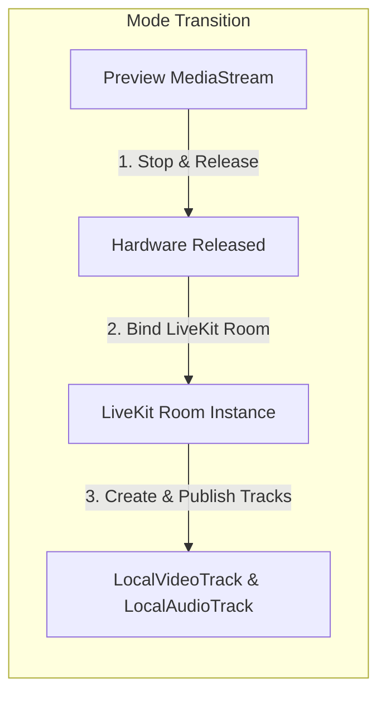

# Plan 03: Meeting WebRTC Camera & Microphone Controls (Phase 3)

---

## 1. Goal & Scope

Unify in-meeting LiveKit WebRTC camera and microphone controls (`MeetingComponent`, `MeetingService`, `CameraService`). Replace scattered track publishing, mute/unmute loops, background effect handling, and device switching with standardized, safe controller methods.

---

## 2. Technical Design & Workflow

### 2.1 In-Meeting Track State vs Preview State
When entering a meeting, the engine transitions from `PREVIEW` to `IN_MEETING` mode:
1. Preview `MediaStream` is stopped and released.
2. The active LiveKit `Room` instance is bound to the engine via `bindLiveKitRoom(room)`.
3. Camera and microphone are published as LiveKit `LocalTrackPublication`s.

### 2.2 Standardized Camera & Mic Toggling Logic

#### Camera Toggle Flow:
1. Check if camera track publication already exists on `room.localParticipant`.
2. **Turn OFF**:
   - Call `room.localParticipant.setCameraEnabled(false)` (or mute/unpublish).
   - If virtual background is active, call `videoBackgroundService.removeBackground()`.
   - Update `isCameraOn.set(false)`.
3. **Turn ON**:
   - If track exists, call `room.localParticipant.setCameraEnabled(true)`.
   - If no track exists (e.g. joined audio-only), call `createCameraTrack(selectedCameraId)` and `room.localParticipant.publishTrack(videoTrack)`.
   - Update `isCameraOn.set(true)`.

#### Microphone Toggle Flow:
1. **Mute**:
   - Call `audioTrack.mute()` (preserves WebRTC SDP connection for instant response without renegotiation delay).
   - Update `isMicOn.set(false)`.
2. **Unmute**:
   - Call `audioTrack.unmute()`.
   - If no audio track exists, call `room.localParticipant.setMicrophoneEnabled(true, { deviceId })`.
   - Update `isMicOn.set(true)`.

---

## 3. Files to Modify

### 3.1 `src/app/meeting/meeting.service.ts`
- **Current Issue**: Contains inline implementations for `turnCameraOn`, `turnCameraOff`, `enableCameraInternal`, `enableMicInternal`, `toggleCamera`, `toggleMic`.
- **Modifications**:
  - Delegate `toggleCamera()`, `toggleMic()`, `enableCamera()`, and `enableMic()` directly to `UnifiedMediaService`.
  - On room connection, call `UnifiedMediaService.bindLiveKitRoom(room)`.
  - On room leave, call `UnifiedMediaService.unbindLiveKitRoom()`.

### 3.2 `src/app/meeting/meeting.component.ts`
- **Current Issue**:
  - Line 588 (`activeMic`): Directly calls `navigator.mediaDevices.getUserMedia({ audio: true })`.
  - Line 698 (`changeMicrophone`): Directly calls `room.localParticipant.setMicrophoneEnabled(true, { deviceId })`.
- **Modifications**:
  - Replace inline `activeMic()` with `UnifiedMediaService.startMic()`.
  - Replace `changeMicrophone(deviceId)` with `UnifiedMediaService.switchMic(deviceId)`.
  - Remove redundant manual track loops.

### 3.3 `src/app/providers/services/camera.service.ts`
- **Current Issue**: Commented-out legacy code blocks (`switchCamera_Old`, `startCamera`, `stopCamera`).
- **Modifications**:
  - Clean up legacy commented sections.
  - Implement robust `enableCamera()`, `disableCamera()`, `switchCamera()`, `enableMic()`, `disableMic()`, `switchMic()`.

---

## 4. Expected Effects & Impact
- **Instant Mute/Unmute**: No audio delay or WebRTC renegotiation freezing when clicking mute/unmute.
- **Background Effect Stability**: Virtual background automatically detaches and reattaches without video blackouts.
- **Clean In-Call Device Switching**: Switching input devices (e.g. plugging in AirPods/webcam) works smoothly without reloading the room.

---

## 5. Pros & Cons

### Pros
- Eliminates inline `getUserMedia` bypasses from `MeetingComponent`.
- Standardizes video quality settings (`VideoPresets.h720`) across initial join and mid-meeting device switches.
- Preserves SDP stability during rapid mute/unmute clicks.

### Cons & Mitigation
- *Risk*: Switching cameras while virtual background is active could throw if background processor isn't re-bound to the new track.
- *Mitigation*: Ensure `switchCamera` removes background from old track and applies background to new track before publishing.
