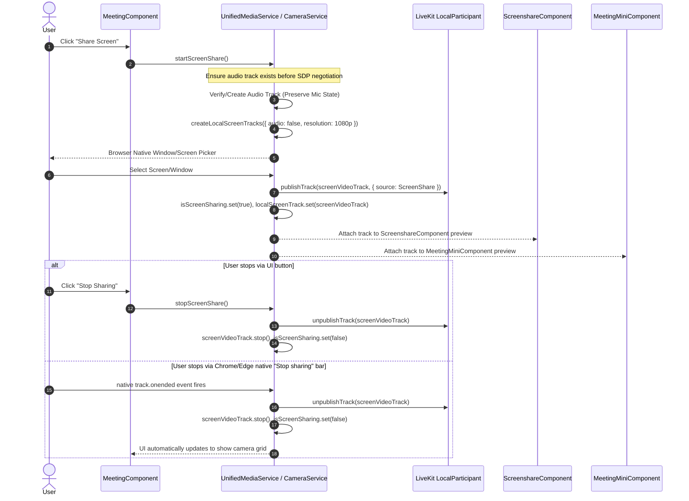

# Plan 04: Screen Sharing Unification (Phase 4)

---

## 1. Goal & Scope

Consolidate screen sharing logic into a unified workflow. Eliminate conflicting implementations between `MeetingComponent.shareScreen()` and `CameraService.startScreenShare()`, standardize 1080p display capture, enforce audio track isolation (preventing mic collisions), and provide automatic handling when the user stops sharing via browser native UI.

---

## 2. Technical Design & Workflow

### 2.1 Unified Screen Share Lifecycle



### 2.2 Screen Audio Isolation Rule
- **Rule**: Screen tracks are created with `audio: false`.
- **Reason**: Capturing system audio through display media can cause echo, ducking, or conflicts with the active microphone audio track on Windows and macOS. Microphone audio remains strictly managed by the microphone controller.

---

## 3. Files to Modify

### 3.1 `src/app/providers/services/camera.service.ts`
- **Current Issue**: `startScreenShare()` (line 261) uses raw `(navigator.mediaDevices as any).getDisplayMedia()` without LiveKit source tagging, creating track publishing inconsistencies.
- **Modifications**:
  - Implement standardized `startScreenShare()` using LiveKit `createLocalScreenTracks({ audio: false, resolution: { width: 1920, height: 1080 } })`.
  - Attach `track.mediaStreamTrack.onended` to automatically trigger `stopScreenShare()`.
  - Maintain `localScreenTrack = signal<LocalVideoTrack | undefined>(undefined)` and `isScreenSharing = signal<boolean>(false)`.

### 3.2 `src/app/meeting/meeting.component.ts`
- **Current Issue**: Lines 488–580 contain 90+ lines of manual track creation, muting, publishing, and publication iteration.
- **Modifications**:
  - Replace `shareScreen()` and `stopScreenShare()` with:
    ```typescript
    async shareScreen() {
      await this.cameraService.startScreenShare(this.room());
    }
    async stopScreenShare() {
      await this.cameraService.stopScreenShare(this.room());
    }
    ```
  - Bind template screen visibility directly to `cameraService.isScreenSharing()` or `roomService.remoteSharescreenTrack()`.

### 3.3 `src/app/meeting/screenshare/screenshare.component.ts`
- **Current Issue**: Relies on `@Input() localScreenTrack` which requires manual binding updates.
- **Modifications**:
  - Bind preview video element to `cameraService.localScreenTrack()` signal.

---

## 4. Expected Effects & Impact
- **No Audio Glitches**: Starting/stopping screen share does not mute or disconnect participant voice audio.
- **Flawless Native Teardown**: Clicking the native floating "Stop sharing" bar immediately resets the UI and notifies all meeting participants.
- **Consistent High Definition**: Crisp 1080p resolution at 30fps with automatic bitrate adaptation.

---

## 5. Pros & Cons

### Pros
- Eliminates 100+ lines of duplicated code across `MeetingComponent` and `CameraService`.
- Guarantees proper WebRTC SDP renegotiation sequencing.
- Synchronizes screen share state between full meeting and floating mini-meeting window.

### Cons & Mitigation
- *Risk*: If user cancels the native screen share picker dialog, an error is thrown.
- *Mitigation*: Catch `NotAllowedError` silently and avoid setting any error state when user intentionally cancels the browser picker.
