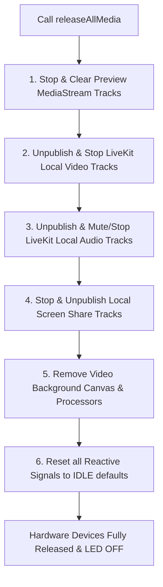

# Plan 05: Teardown, Lifecycle & Edge Cases (Phase 5)

---

## 1. Goal & Scope

Implement a deterministic, leak-proof teardown sequence and handle edge cases (background tabs, browser window focus changes, hardware hot-plugging, unexpected disconnections, and route changes) so that no camera LED or microphone track remains open when not actively in use.

---

## 2. Technical Design & Teardown Architecture

### 2.1 Complete Teardown Checklist (`releaseAllMedia`)

When a user leaves a meeting, cancels preview, or logs out, `releaseAllMedia()` executes the following comprehensive cleanup:

### 2.2 Edge Case Handling Matrix

| Edge Case Scenario | Root Cause | Handling Strategy |
| :--- | :--- | :--- |
| **Tab Switched to Background** | Browser suspends timers / video elements | `MediaPermissionsService` listens to `visibilitychange`; preserves audio track active while backgrounded, re-verifies video rendering on tab focus. |
| **User Unplugs Active USB Webcam/Headset** | Hardware device disappears mid-call | `navigator.mediaDevices.ondevicechange` triggers automatic device re-enumeration; falls back to default system device without dropping call. |
| **Browser "Back" / "Reload" Clicked** | Angular component destroyed unexpectedly | `ngOnDestroy()` and `window.onbeforeunload` trigger synchronous track disposal (`track.stop()`) on all active tracks. |
| **Virtual Background applied while camera is OFF** | Canvas processor tries to read null video stream | Background processor is only attached when video track is active; cleanly disposed before track unpublication. |

---

## 3. Files to Modify

### 3.1 `src/app/providers/services/camera.service.ts`
- **Modifications**:
  - Implement comprehensive `releaseAllMedia()` method.
  - Implement `stopAllTracks(room: Room)` with safe null-checking on track publications.
  - Add `devicechange` listener to auto-refresh device list on hardware plug/unplug.

### 3.2 `src/app/meeting/meeting.service.ts`
- **Modifications**:
  - Ensure `leaveRoom()` and `resetState()` call `releaseAllMedia()`.

### 3.3 `src/app/preview/preview.component.ts` & `src/app/meeting/meeting.component.ts`
- **Modifications**:
  - In `ngOnDestroy()`, guarantee `releaseAllMedia()` is called if leaving the meeting flow.

---

## 4. Expected Effects & Impact
- **Zero Orphaned Streams**: Guarantees no hidden background tracks consume CPU/battery.
- **Hardware Hot-Plugging**: Seamless recovery when user plugs or unplugs headsets/cameras during an ongoing meeting.
- **Clean Browser Navigation**: Back button and page reloads cleanly close hardware connections.

---

## 5. Pros & Cons

### Pros
- Protects user privacy by ensuring webcam and mic are never accidentally left running.
- Eliminates memory leaks and dangling WebRTC peer connections.

### Cons & Mitigation
- *Risk*: `releaseAllMedia()` called prematurely when navigating between preview and full meeting.
- *Mitigation*: Distinguish between `stopMediaPreview()` (stops preview stream only) and `releaseAllMedia()` (full exit teardown).
