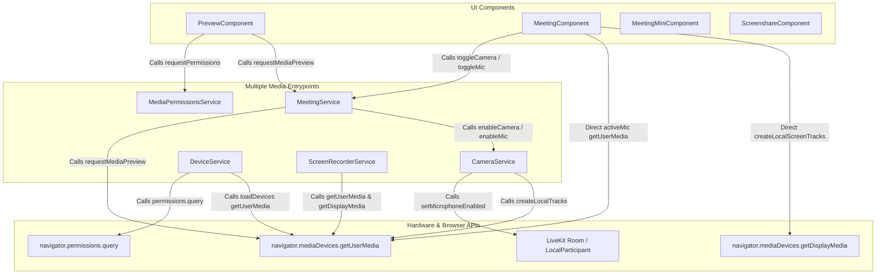
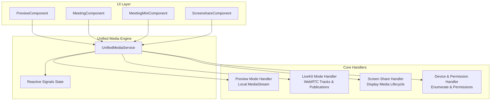

# Unified Media Device Management Architecture & Implementation Plan
**Single Point of Control for Camera, Microphone, and Screen Sharing**

---

## 1. Executive Summary & Objective

Currently, media device acquisition, lifecycle control, track publishing, and hardware teardown are split across multiple disparate services and components:
- `MediaPermissionsService` (Permissions API queries & fallback `getUserMedia` probes)
- `DeviceService` (Device enumeration & initial permission probing)
- `CameraService` (LiveKit track creation, muting, publishing, and display media)
- `MeetingService` (Preview stream acquisition, in-meeting camera/mic toggling, media release)
- `MeetingComponent` (Direct `navigator.mediaDevices.getUserMedia` for mic activation, direct `createLocalScreenTracks` for screen sharing)
- `PreviewComponent` (Preview stream attachments, direct permission requests)
- `ScreenRecorderService` (Independent screen and camera capture for recording)

### Objective
Unify all camera, microphone, and screen sharing operations into a **single, robust, mode-aware Media Controller Service** without breaking existing functionalities:
1. **Single Point of Control**: Every start, stop, toggle, switch, and release operation for camera, mic, and screen share passes through a single unified interface.
2. **Zero Regressions & Compatibility**: Seamless interoperability across Preview Mode (raw `MediaStream`), Active Call Mode (LiveKit WebRTC `Room`), and Mini Mode.
3. **Deterministic Hardware Release**: Guarantee zero camera indicator light sticking and zero lingering microphone tracks when navigating or switching modes.
4. **Unified State Management**: Clean Angular Signals for media state (`isCameraOn`, `isMicOn`, `isScreenSharing`, `selectedCameraId`, `selectedMicId`, `selectedSpeakerId`, `mediaError`).

---

## 2. Current Architecture & Problem Analysis

### 2.1 Current State Diagram



### 2.2 Key Issues & Vulnerabilities in Current Design

| Issue | Location | Risk / Impact |
| :--- | :--- | :--- |
| **Dual Screen Share Implementations** | `MeetingComponent.shareScreen()` vs `CameraService.startScreenShare()` | Inconsistent track handling; `MeetingComponent` creates screen tracks manually with `createLocalScreenTracks` while `CameraService` uses `getDisplayMedia`, leading to race conditions and inconsistent SDP negotiations. |
| **Direct `getUserMedia` in Components** | `MeetingComponent.activeMic()` | Bypasses services, creating unmanaged tracks that might not get stopped if component state abruptly changes. |
| **Camera Light Sticking on Permission Checks** | `DeviceService.loadDevices()` & `MediaPermissionsService.fallbackPermissionCheck()` | If tracks aren't synchronously stopped in all fallback branches, the hardware camera LED remains illuminated. |
| **Split Preview vs LiveKit State** | `MeetingService._previewStream` vs `MeetingService.localTrack` | Switching from preview to active meeting requires manual stream teardown and recreation, which can fail if timing isn't strictly synchronized. |
| **Mic Track Conflicts during Screen Share** | `MeetingComponent.shareScreen()` | Special logic exists to create audio tracks before screen share to prevent WebRTC SDP renegotiation conflicts; this logic is currently scattered across components. |

---

## 3. Proposed Unified Architecture

### 3.1 Unified Media Service Pattern

The unified design centralizes all media stream and WebRTC track lifecycle into a single orchestrator: **`UnifiedMediaService`** (or upgraded unified **`CameraService` / `MeetingMediaService`**).



### 3.2 Unified API Interface

```typescript
export interface IUnifiedMediaService {
  // Signals (Single Source of Truth)
  readonly isCameraOn: Signal<boolean>;
  readonly isMicOn: Signal<boolean>;
  readonly isScreenSharing: Signal<boolean>;
  readonly isMediaLoading: Signal<boolean>;
  readonly currentMediaMode: Signal<'idle' | 'preview' | 'in-meeting'>;
  readonly localCameraTrack: Signal<LocalVideoTrack | undefined>;
  readonly previewStream: Signal<MediaStream | undefined>;
  readonly localScreenTrack: Signal<LocalVideoTrack | undefined>;
  
  // Camera Controls
  startCamera(deviceId?: string): Promise<boolean>;
  stopCamera(): Promise<void>;
  toggleCamera(deviceId?: string): Promise<boolean>;
  switchCamera(deviceId: string): Promise<boolean>;
  
  // Microphone Controls
  startMic(deviceId?: string): Promise<boolean>;
  stopMic(): Promise<void>;
  toggleMic(deviceId?: string): Promise<boolean>;
  switchMic(deviceId: string): Promise<boolean>;
  
  // Screen Share Controls
  startScreenShare(): Promise<LocalVideoTrack | undefined>;
  stopScreenShare(): Promise<void>;
  toggleScreenShare(): Promise<boolean>;
  
  // Lifecycle & Session Transitions
  initPreviewSession(enableVideo: boolean, cameraDeviceId?: string, micDeviceId?: string): Promise<MediaStream | undefined>;
  bindLiveKitRoom(room: Room): void;
  unbindLiveKitRoom(): void;
  releaseAllMedia(): Promise<void>;
}
```

---

## 4. Phased Implementation Plan

### Phase 1: Core Unified Media Service & State Foundation
**Target**: Create the unified media management orchestrator without changing existing component bindings yet.

- **Tasks**:
  1. Create or consolidate the core methods in `CameraService` (or dedicated `UnifiedMediaService`).
  2. Implement state signals: `isCameraOn`, `isMicOn`, `isScreenSharing`, `previewStream`, `localVideoTrack`, `localScreenTrack`.
  3. Support internal mode awareness:
     - **`PREVIEW` mode**: manages raw `MediaStream` (`navigator.mediaDevices.getUserMedia`).
     - **`IN_MEETING` mode**: manages LiveKit `Room.localParticipant` tracks (`LocalVideoTrack`, `LocalAudioTrack`, `LocalScreenTrack`).
  4. Ensure robust error handling for `NotAllowedError`, `NotFoundError`, and `OverconstrainedError`.

- **Effect**: Core media functions are consolidated into a testable unit.
- **Risk / Mitigation**: No consumer changes yet; zero risk to existing runtime.

---

### Phase 2: Preview Flow Integration & Device Probing Clean-up
**Target**: Refactor `PreviewComponent`, `DeviceService`, and `MediaPermissionsService` to use the unified service.

- **Tasks**:
  1. Update `PreviewComponent.initializeMediaStream()`, `startPreview()`, and `stopPreview()` to call the unified service.
  2. Refactor `DeviceService.loadDevices()` so it delegates probe stream acquisition and teardown to the unified service, guaranteeing immediate track disposal.
  3. Ensure `PreviewComponent.destroy()` and `ngOnDestroy()` cleanly invoke `releaseAllMedia()`.

- **Effects**:
  - Eliminates duplicate preview streams.
  - Prevents camera LED hardware light from getting stuck during preview checks.
- **Testing Verification**:
  - Audio-only preview (camera LED stays OFF, mic indicator active).
  - Video call preview (camera and mic both initialize smoothly).
  - Rapid navigation away from preview (camera & mic instantly power down).

---

### Phase 3: Active Meeting Room (LiveKit WebRTC) Camera & Mic Unification
**Target**: Refactor `MeetingService` and `MeetingComponent` camera/mic toggles and device switching.

- **Tasks**:
  1. Direct all camera operations (`toggleCamera`, `switchCamera`, `turnCameraOn`, `turnCameraOff`) in `MeetingService` and `MeetingComponent` to the unified service.
  2. Direct all microphone operations (`toggleMic`, `changeMicrophone`, `enableMic`, `disableMic`, `activeMic`) to the unified service.
  3. Remove inline `navigator.mediaDevices.getUserMedia({ audio: true })` inside `MeetingComponent.activeMic()` and delegate to `UnifiedMediaService.startMic()`.
  4. Integrate `VideoBackgroundService` directly into track lifecycle callbacks.

- **Effects**:
  - Single method handles mute/unmute and track replacement.
  - Consistent device ID switching with automatic fallback.
- **Testing Verification**:
  - In-meeting camera mute/unmute.
  - In-meeting microphone mute/unmute.
  - Device dropdown switching for camera, mic, and speaker.
  - Virtual background application/removal when toggling camera.

---

### Phase 4: Screen Sharing Unification
**Target**: Eliminate fragmented screen sharing logic across `MeetingComponent` and `CameraService`.

- **Tasks**:
  1. Standardize screen track creation inside the unified service using LiveKit's `createLocalScreenTracks` with fixed `audio: false` (to prevent microphone collision).
  2. Implement automatic detection of browser UI "Stop Sharing" (`track.onended`).
  3. Connect local screen preview in `ScreenshareComponent` and mini-window in `MeetingMiniComponent`.
  4. Provide clean `startScreenShare()` and `stopScreenShare()` methods callable from header/toolbar buttons.

- **Effects**:
  - Consistent screen capture resolution (1080p, 30fps).
  - No mic dropout or WebRTC renegotiation errors during screen share start/stop.
- **Testing Verification**:
  - Start screen share -> check local & remote render.
  - Stop screen share via application toolbar button.
  - Stop screen share via Chrome native "Stop sharing" bar.
  - Screen share with mic muted vs unmuted.

---

### Phase 5: Teardown, Background Tabs & Edge Case Hardening
**Target**: Guarantee leak-proof teardown and seamless recovery across edge cases.

- **Tasks**:
  1. Implement `releaseAllMedia()` with comprehensive checks:
     - Stop preview stream tracks.
     - Unpublish & stop LiveKit video tracks.
     - Unpublish & mute/stop LiveKit audio tracks.
     - Stop & unpublish screen share tracks.
     - Reset all state signals.
  2. Handle browser tab visibility change and window focus cleanly via `MediaPermissionsService`.
  3. Handle physical hardware disconnection (e.g. USB webcam/headset unplugged during call).

- **Effects**:
  - Zero memory leaks, zero hanging WebRTC peers, zero lingering camera/mic locks.

---

## 5. Component-by-Component Modification Matrix

| File Path | Current Role | Modifications | Expected Impact |
| :--- | :--- | :--- | :--- |
| **`src/app/providers/services/camera.service.ts`** | LiveKit track & screen share helper | Expand into **Unified Media Controller**: implement state signals, mode switching (`preview` vs `in-meeting`), screen share lifecycle, device switching. | Becomes single source of truth for all media. |
| **`src/app/meeting/meeting.service.ts`** | Meeting state & media delegate | Delegate all media actions (`requestMediaPreview`, `toggleCamera`, `toggleMic`, `releaseAllMedia`) directly to the unified `CameraService`. | Simplifies service; eliminates duplicate track management. |
| **`src/app/meeting/meeting.component.ts`** | Meeting view & controls | Replace direct `createLocalScreenTracks` and `activeMic()` calls with calls to unified service. Remove duplicated track publication loops. | Cleaner component logic, eliminates race conditions. |
| **`src/app/preview/preview.component.ts`** | Pre-meeting device check | Use unified service for preview stream acquisition, camera/mic toggle, and teardown. | Streamlined preview, no lingering camera hardware locks. |
| **`src/app/layout/device.service.ts`** | Device enumeration | Delegate probe stream lifecycle to unified service; remove duplicate inline stream stops. | Consistent device IDs without multiple permission prompts. |
| **`src/app/meeting/screenshare/screenshare.component.ts`** | Screen share container | Bind preview element to reactive screen track signal from unified service. | Instant, reliable screen share rendering. |
| **`src/app/meeting-mini/meeting-mini.component.ts`** | Floating mini meeting window | Read reactive signals from unified service for mic/camera/screen state indicators. | Synchronized state between full and mini view. |

---

## 6. Pros & Cons Analysis

### Pros
1. **Zero State Desynchronization**: A single signal store (`isCameraOn`, `isMicOn`, `isScreenSharing`) prevents UI toggle mismatches between buttons, headers, and mini-views.
2. **Reliable Hardware Release**: Hardware camera LEDs and microphones are guaranteed to release immediately upon mute, preview leave, or meeting exit.
3. **Streamlined WebRTC Negotiation**: Centralized track publication eliminates SDP collisions when toggling screen share and mic simultaneously.
4. **Maintainability & Debuggability**: One file contains all media lifecycle logic and diagnostic logging, making future WebRTC or LiveKit upgrades straightforward.
5. **No Regressions**: Existing public methods in `MeetingService` can remain as transparent delegates to preserve compatibility with all consumer components.

### Cons & Mitigations
| Potential Con / Risk | Mitigation Strategy |
| :--- | :--- |
| **LiveKit vs Preview Stream mismatch** | Mode-aware state machine inside unified service clearly separates raw `MediaStream` (Preview) from LiveKit `Track` (In-Meeting). |
| **Microphone audio track muting vs stopping** | For in-meeting microphone, retain `track.mute()` / `setMicrophoneEnabled(false)` instead of full track disposal to ensure instant unmute without renegotiation delays. |
| **Browser-specific screen share quirks** | Standardize `audio: false` on display media to prevent cross-platform OS system audio capture conflicts. |

---

## 7. Comprehensive Section-by-Section Testing & Verification Plan

### Test Suite 1: Device Permissions & Enumeration
- [ ] **Initial Permission Query**: Fresh browser session prompts once for Camera & Mic permissions.
- [ ] **Device Enumeration**: Real device labels and IDs populate in Camera, Microphone, and Speaker dropdowns without duplicate permission popups.
- [ ] **Permission Denied**: Modal appears with browser-specific instructions if permission is blocked.

### Test Suite 2: Preview Mode Lifecycle
- [ ] **Video Call Preview**: Both Camera and Mic active; video displays in preview element.
- [ ] **Audio-Only Preview**: Camera is completely inactive (LED OFF); only mic is active.
- [ ] **Preview Camera Toggle**: Clicking camera button toggles video track and powers down webcam LED when OFF.
- [ ] **Preview Mic Toggle**: Clicking mic button disables audio track.
- [ ] **Exit Preview**: Navigating back/away immediately stops all preview tracks.

### Test Suite 3: In-Meeting WebRTC Controls
- [ ] **Camera Toggle In-Meeting**: Toggling camera publishes/unpublishes video track; remote participants see video update in real-time.
- [ ] **Microphone Toggle In-Meeting**: Toggling mic mutes/unmutes audio; speaking indicator reflects state accurately.
- [ ] **Virtual Background**: Enabling blur/virtual background on camera works seamlessly and removes cleanly on camera OFF.
- [ ] **Device Switching**: Changing camera or microphone in settings switches input device in place without dropping the call.

### Test Suite 4: Screen Sharing Flow
- [ ] **Start Screen Share**: Browser native picker opens; selected window/screen renders in `ScreenshareComponent`.
- [ ] **Stop via UI Button**: Clicking "Stop Sharing" in application toolbar stops track and notifies remote participants.
- [ ] **Stop via Native Bar**: Clicking "Stop sharing" in Chrome floating bar triggers `track.onended` and cleanly updates UI.
- [ ] **Simultaneous Screen Share + Mic**: Starting screen share while mic is ON/OFF does not interrupt participant audio.

### Test Suite 5: Mini-Mode & Background Navigation
- [ ] **Minimize to Mini-Meeting**: Media tracks continue playing uninterrupted in floating mini window.
- [ ] **Maximize back to Full Meeting**: Screen share and video tiles reattach cleanly.
- [ ] **Leave Call**: Complete cleanup of all media, peer connections, and hardware resources.
